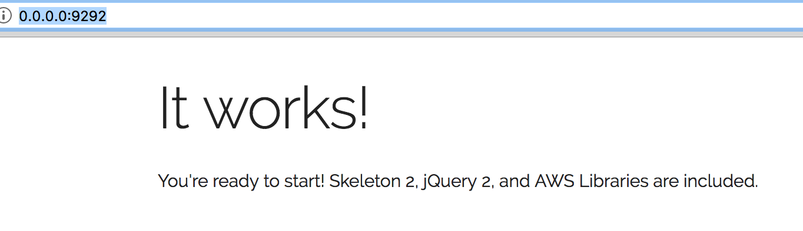
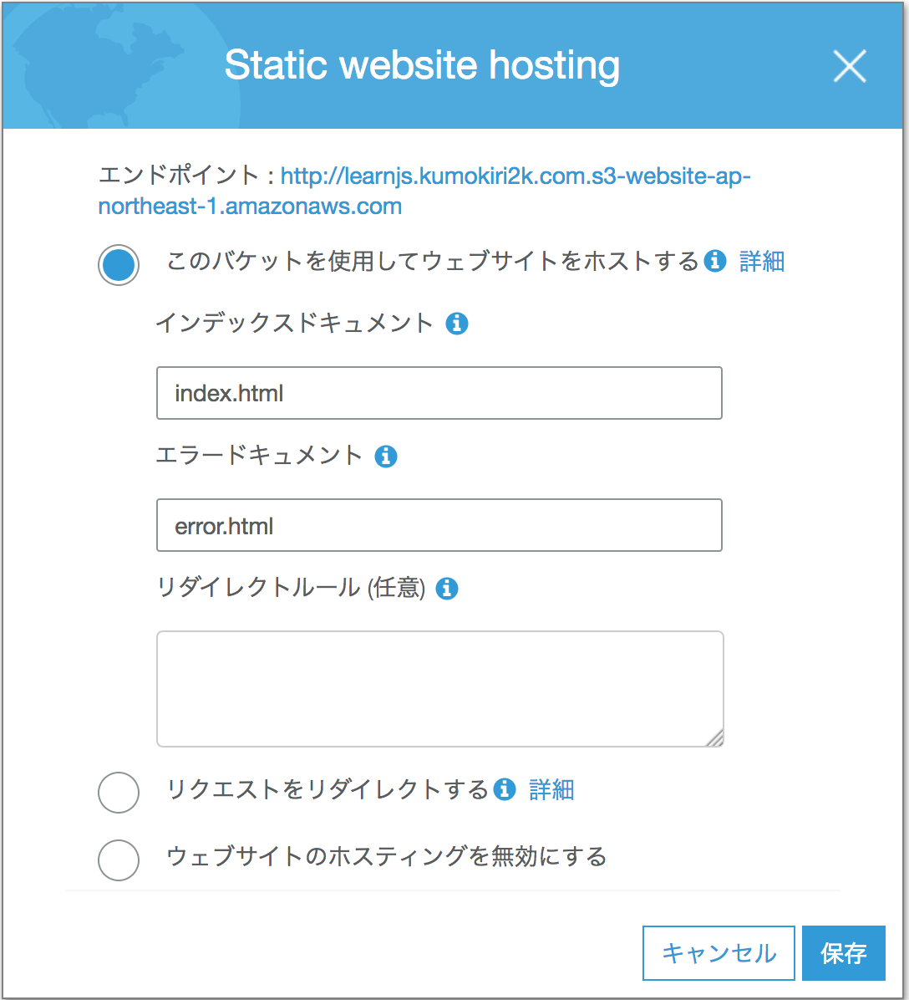

# オライリー サーバーレスシングルページアプリケーション

## ワークスペース
P11 に、整備済みワークスペースの件が記載があるが、ちょっと理解しづらい。
最終的に

```https://github.com/benrady/learnjs```

から、自分の git hub アカウントへフォークして、

```
$ git clone https://github.com/kumokiri2kdev/learnjs
```
でクローンすると理解。

## ローカル実行環境
### sspa スクリプト
bash で書かれたスクリプトで、これを

```
$ ./sspa server
```
とすると、

```http://0.0.0.0:9292/```

に ブラウザからアクセスするとトップページが見れるようになる。



## ランディングページ
コードの ```/images/``` のところは、```image/``` にする必要がある。
ここだけではなく、全体的にそういう対応が必要。

``` html
    <script src='/vendor.js'></script>
    <script src='/app.js'></script>
```
ここも同様の対応が必要。

## Deploy
```
./sspa deploy_bucket learnjs.kumokiri2k.com
```

## Static Web Site Hosting
index.html のリンクではなく、bucket の プロパティタブの Static WebSite Hosting の エンドポイントがアプリの URL になる。




