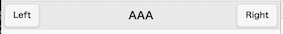

# jQuery Mobile

## ヴァージョン
ここでは、1.4.5を使用

## テンプレート
``` html

<!DOCTYPE html> 
<html>
    <head> 
        <meta charset="utf-8">
        <title>sample</title>
        <meta name="viewport" content="width=device-width, initial-scale=1"> 
        <link rel="stylesheet" href="http://code.jquery.com/mobile/1.4.5/jquery.mobile-1.4.5.min.css" />
        <script src="http://code.jquery.com/jquery-2.1.4.min.js"></script>
        <script src="http://code.jquery.com/mobile/1.4.5/jquery.mobile-1.4.5.min.js"></script>
    </head>
    
    <body>

    </body>
</html>
```

## セレクタ 

|利用例|抽出される要素|
|:---:|:---:|
|$('#main')|id="main"の要素|


## anchor のクリックイベントのハンドリング
``` html
<a href="#msg" id='btn_update'>更新</a>
```

のアンカーがある場合、

```javascript
$('#btn_update').click(function(event){
	//event.preventDefault();　　This makes the 
	
	});
```
というハンドラーを書けば、js 側で処理をハンドリングできる。

## page

```html
<div data-role="page">
	<div data-role="header" data-position="fixed">
    	<h1>AAA</h1>
   </div>			
   <div data-role="content">
   
   </div>
   <div data-role="footer">
   		<h1><br></h1>
   </div>
</div>
```
### header
header 
Hタグを挟んで左右にボタンを置く場合

``` html
<div data-role="header" data-position="fixed">
	<a href="#">Left</a>
	<h1>AAA</h1>
	<a href="#">Right</a>                
</div> 
```


右側だけに置きたい場合は、

```html
<div data-role="header" data-position="fixed">
	<h1>AAA</h1>
	<a href="#">Right</a>                
</div>      
```
こうしてしまうと、  


となるので、

``` html
<div data-role="header" data-position="fixed">
	<h1>AAA</h1>
	<a href="#" class="ui-btn-right">Right</a>                
</div>   
```
とすると、  


このようになる。


##listview

### data-divider

``` html
<ul id='lv' data-role="listview" data-divider-theme="b" data-inset="true">
	<li data-role="list-divider">メニュー</li>
   	<li>日記</li>
   	<li>画像</li>
	<li data-role="list-divider">メニュー2</li>
	<li>日記2</li>
	<li>画像2</li>      
</ul>
```


動的な挿入例

``` javascript
var schedule_field = $('#schedule_field')
            
for (var i = 0; i < data.girls.length; i++){
	girl = data.girls[i]
	$('<li data-role="list-divider">' + girl.name + '</li>').appendTo(schedule_field);
	
	for(var j = 0; j < girl.schedule.length; j++){
		$('<li>' + girl.schedule[j][0] + ' : ' + girl.schedule[j][1] + '</li>').appendTo(schedule_field);
    }
}

schedule_field.listview('refresh'); // Without this, style won't be applied to elements dynamically addded.
```
ちなみに、すでにエレメントが入ってるエレメントに append すると実際に追加になってしまうので、

``` javascript
schedule_field.empty();
```
とする。


## loader
表示

``` javascript
$.mobile.loading("show");

```


非表示

``` javascript
$.mobile.loading("hide");
```


