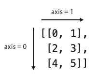

# ndarray

## axis

- axis = 0 => 列方向
- axis = 1 => 行方向




## ブロードキャスト
ブロードキャストは、計算を配列全てに適用する機能。

``` python
import numpy as np

a = np.array([1, 2, 3])
b = np.array([[1, 1, 1], [2, 4, 1]])

b + a
```

```
array([[2, 3, 4],
       [3, 6, 4]])
```

## ndarray.shape
各次元ごとの要素数を示す。


``` python
a = np.array([i for i in range(4)]
a.shape
```
```
array([0, 1, 2, 3])

(4,)
```
``` python
a = np.array([i for i in range(6)]).reshape((3,2))      
```
```
array([[0, 1],
       [2, 3],
       [4, 5]])

(3, 2)
```

shape プロパティに 型を代入すると、reshape と同じ動きをする。

``` python
a = np.array([i for i in range(10)])

a.shape = ((5, 2))
```
```
array([0, 1, 2, 3, 4, 5, 6, 7, 8, 9])

array([[0, 1],
       [2, 3],
       [4, 5],
       [6, 7],
       [8, 9]])
```
