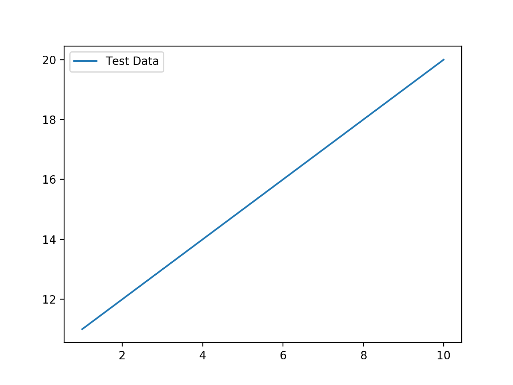
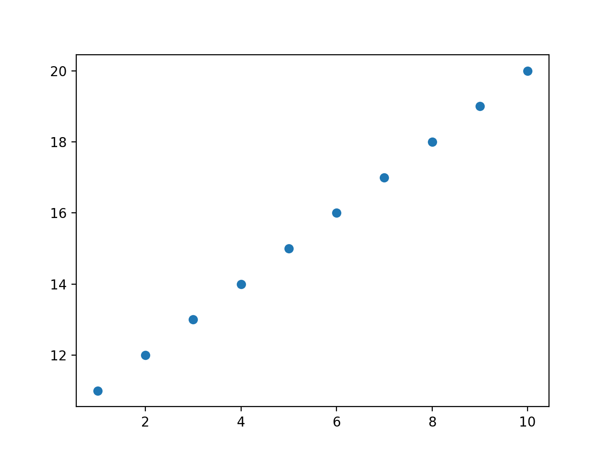
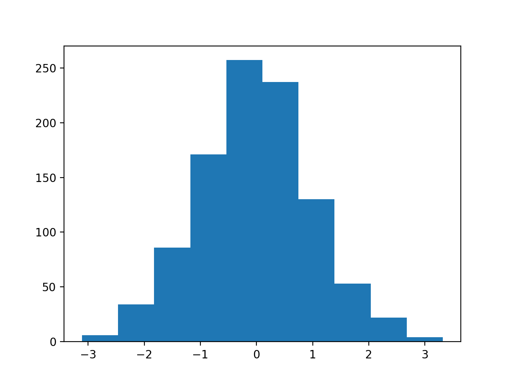
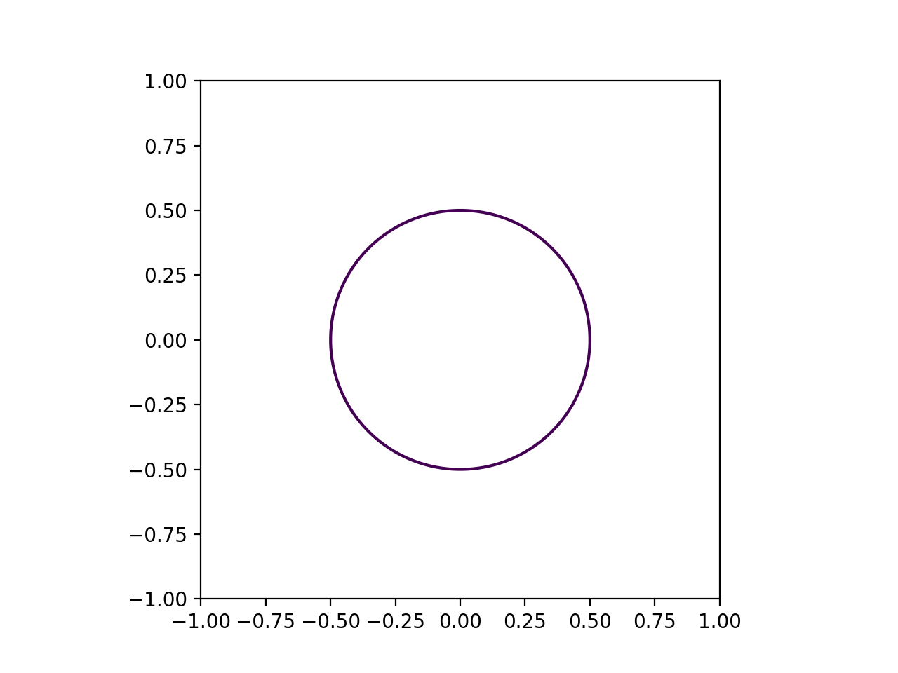
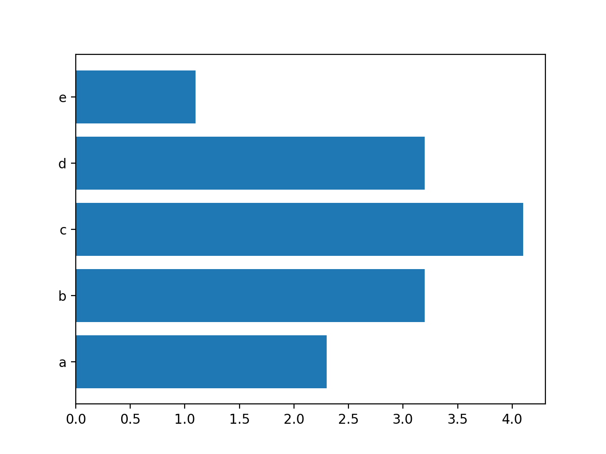

# Python

## python

### 配列のfor ループ
``` python
ary = [1, 2, 3]

for data in ary:
	print("data : {}".format(data))
```
```
data : 1
data : 2
data : 3
```
### 配列の index を取りながらループ

``` python
for i, data in enumerate(ary):
	print("data[{}] : {}".format(i, data))

```
```
data[0] : 1
data[1] : 2
data[2] : 3
```

### 複数の配列を同時に取り出す

``` python
ary1 = [1, 2, 3]
ary2 = [4, 5, 6]

for data1, data2 in zip(ary1, ary2):
	print("data1 : {}, data2 : {}".format(data1, data2))
```
```
data1 : 1, data2 : 4
data1 : 2, data2 : 5
data1 : 3, data2 : 6
```

### zip と enumerate を同時に使う

``` python
for (i, data1), data2 in zip(enumerate(ary1), ary2):
	print("[{}] data1 : {}, data2 : {}".format(i, data1, data2))
```
```
[0] data1 : 1, data2 : 4
[1] data1 : 2, data2 : 5
[2] data1 : 3, data2 : 6
```

## numpy

``` python
import numpy as np
```

### 等間隔の配列データ作成
-10 から 9.5 までの 0.5 刻みのデータを作成。 

``` python
np.arange(-10,10, 0.5)
```

```
array([-10. ,  -9.5,  -9. ,  -8.5,  -8. ,  -7.5,  -7. ,  -6.5,  -6. ,
        -5.5,  -5. ,  -4.5,  -4. ,  -3.5,  -3. ,  -2.5,  -2. ,  -1.5,
        -1. ,  -0.5,   0. ,   0.5,   1. ,   1.5,   2. ,   2.5,   3. ,
         3.5,   4. ,   4.5,   5. ,   5.5,   6. ,   6.5,   7. ,   7.5,
         8. ,   8.5,   9. ,   9.5])
```

データは２番目の引数までは到達しない。

-10 から 10までの間を n 個に分割した配列データを作成。

``` python
np.linspace(-10, 10, 20)
```
```
array([-10.        ,  -8.94736842,  -7.89473684,  -6.84210526,
        -5.78947368,  -4.73684211,  -3.68421053,  -2.63157895,
        -1.57894737,  -0.52631579,   0.52631579,   1.57894737,
         2.63157895,   3.68421053,   4.73684211,   5.78947368,
         6.84210526,   7.89473684,   8.94736842,  10.        ])
```

こっちは、２番目の引数に到達する。

### n個のゼロの配列を作成する

``` python
np.zeros(10,dtype=int)
```
```
array([0, 0, 0, 0, 0, 0, 0, 0, 0, 0])
```
```dtype``` デフォルトだと float 型になる。
```str``` を指定すると、空の文字列になる。


### 配列の次元を変更する
1 x 10 の配列を、2 x 5 の配列にする。

``` python
ary = np.arange(0,10, 1)
ary.reshape(5,2)
```

```
array([[0, 1],
       [2, 3],
       [4, 5],
       [6, 7],
       [8, 9]])
```
列と行の順番が逆の感覚。

1 x n の配列を n x 1 の配列にする場合。

``` python
ary = np.arange(0,10, 1)
ary.reshape(-1, 1)
```
```
array([[0],
       [1],
       [2],
       [3],
       [4],
       [5],
       [6],
       [7],
       [8],
       [9]])
```

１次元の配列にする場合、ravel を使用する。


``` python
ary = np.arange(0,10, 1).reshape(5,2)
ary.ravel()
```
```
array([0, 1, 2, 3, 4, 5, 6, 7, 8, 9])
```

### 配列から特定の列を抽出

``` python
ary = np.arange(0, 10).reshape(-1,2)
# Pick up line-0
ary[:,0].reshape(-1, 1)
```
```
array([[0],
       [2],
       [4],
       [6],
       [8]])
```
``` python
# Pick up line-1
ary[:,1].reshape(-1, 1)
```
```
array([[1],
       [3],
       [5],
       [7],
       [9]])
```

### 配列から特定の行を抽出する

``` python
ary[2]
ary[2,]
ary[2,:]
```
全て同じ結果になる。

```
array([4, 5])
```

### 配列から一部を取り出す

``` python
ary = np.arange(0, 100)
ary[10:20]
```
```
array([10, 11, 12, 13, 14, 15, 16, 17, 18, 19])
```

### 配列の結合
二つの配列を結合して、２次元配列にする。

``` python
ary1 = np.arange(0,5)
ary2 = np.arange(5,10)
np.c_[ary1, ary2]
```
```
array([[0, 5],
       [1, 6],
       [2, 7],
       [3, 8],
       [4, 9]])
```


## Matplot lib

### 線引き

``` python
import numpy as np
import matplotlib.pyplot as plt

X_data = np.arange(1, 11)
y_data = np.arange(11, 21)

plt.plot(X_data, y_data, label="Test Data")
plt.legend()
plt.pause(0.5)
#plt.show()
```


### プロット

plot() の３番目の引数を指定すると、プロットした図になる。

``` python
plt.plot(X_data, y_data, "o")
```




### ヒストグラム

``` python
plt.hist(np.random.randn(1000))
```


### 等高線

0.5 のところ（Zの値が 0.5になる所）に、等高線を引く。

``` python
	
import numpy as np
import matplotlib.pyplot as plt
 
n = 100
x = np.linspace(-1, 1, n)
y = np.linspace(-1, 1, n)
 
X, Y = np.meshgrid(x, y)
Z = np.sqrt(X**2 + Y**2)

plt.contour(X, Y, Z, levels=[0.5])

# Set aspect as square
plt.gca().set_aspect('equal')

plt.pause(0.5)
#plt.show()
```



### 横棒グラフ

``` python
import numpy as np
import matplotlib.pyplot as plt

x = np.arange(1,6)
y = np.array([2.3, 3.2, 4.1, 3.2, 1.1])

plt.barh(x, y)
plt.yticks(x, ["a", "b", "c", "d", "e"])

plt.pause(0.5)
#plt.show()
```




## sickit learn

### train_test_split

``` python
from sklearn.model_selection import train_test_split

X, y = make_wave(n_samples=60)
X_train, X_test, y_train, y_test = train_test_split(X, y, random_state=42)

```

### load_breast_cancer
 
``` python
from sklearn.datasets import load_breast_cancer
 
cancer = load_breast_cancer()
```