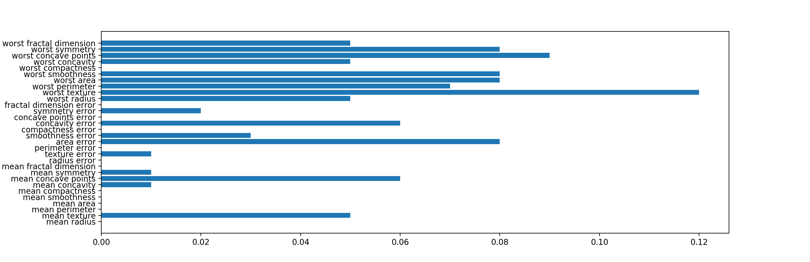

# 勾配ブースティング
## 勾配ブースティング
勾配ブースティングもランダムフォレストと同様に、アンサンブル手法のひとつである。
このモデルでは、回帰にも分類にも利用可能。
勾配ブースティングでは、ひとつ前の決定木の誤りを補正するように決定木を組み立てて行く。

### 勾配ブースティングの例
ランダムフォレストとさほど変わらない手順で構築できる。

``` python
from sklearn.ensemble import GradientBoostingClassifier
from sklearn.datasets import load_breast_cancer
from sklearn.model_selection import train_test_split

cancer = load_breast_cancer()

X_train, X_test, y_train, y_test = train_test_split(cancer.data, cancer.target, random_state=0)

gbrt = GradientBoostingClassifier(random_state=0)
gbrt.fit(X_train, y_train)

print("Accuracy on training set: {:.3f}".format(gbrt.score(X_train, y_train)))
print("Accuracy on test set : {:.3f}".format(gbrt.score(X_test, y_test)))

```
```
Accuracy on training set: 1.000
Accuracy on test set : 0.958
```

### 勾配ブースティングの調整
勾配ブースティングでは、max_depth と learning_rate を使用して調整を行う。

``` python
gbrt = GradientBoostingClassifier(random_state=0,max_depth=1)
gbrt.fit(X_train, y_train)

print("Accuracy on training set: {:.3f}".format(gbrt.score(X_train, y_train)))
print("Accuracy on test set : {:.3f}".format(gbrt.score(X_test, y_test)))
```
```
Accuracy on training set: 0.991
Accuracy on test set : 0.972
```

``` python
gbrt = GradientBoostingClassifier(random_state=0,, learning_rate=0.01)
gbrt.fit(X_train, y_train)

print("Accuracy on training set: {:.3f}".format(gbrt.score(X_train, y_train)))
print("Accuracy on test set : {:.3f}".format(gbrt.score(X_test, y_test)))
```
```
Accuracy on training set: 0.988
Accuracy on test set : 0.965
```

### 決定の重要度
決定木の時と同様に、各要素の重要度を調べる。

``` python
gbrt = GradientBoostingClassifier(random_state=0,max_depth=1)
gbrt.fit(X_train, y_train)
plt.barh(range(cancer.data.shape[1]), gbrt.feature_importances_)
plt.yticks(range(cancer.data.shape[1]), cancer.feature_names)
plt.show()
```



ランダムフォレストと比較すると、完全に無視している要素が多くある事が見て取れる。


