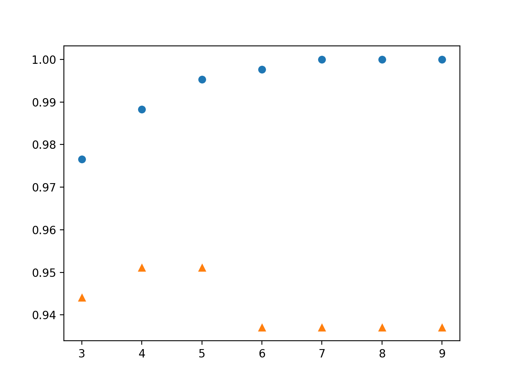
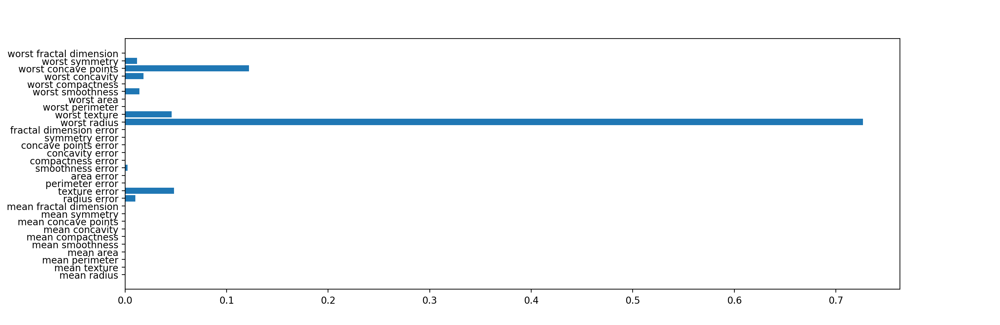

# Decision Tree(決定木）

## 決定木によるクラス分類と木の深さ

``` python
from sklearn.tree import DecisionTreeClassifier
from  sklearn.datasets import load_breast_cancer
from sklearn.model_selection import train_test_split
import numpy as np
import matplotlib.pyplot as plt

cancer = load_breast_cancer()

X_train, X_test, y_train, y_test = train_test_split(cancer.data, cancer.target, stratify=cancer.target, random_state=42)

depths = range(3, 10)
train_score = np.zeros(len(depths))
test_score = np.zeros(len(depths))

for i, depth in enumerate(depths):
  tree = DecisionTreeClassifier(max_depth=depth, random_state=0)
  tree.fit(X_train, y_train)
  print("Max Depth : {}".format(depth))
  train_score[i] = tree.score(X_train, y_train)
  test_score[i] = tree.score(X_test, y_test)
  print(" Accuracy on training set : {}".format(train_score[i]))
  print(" Accuracy on test set : {}".format(test_score[i] ))


plt.plot(depths, train_score, "o")
plt.plot(depths, test_score, "^")

plt.show()
```
結果から判断すると、このデータの場合は、深さは 4 ないし 5 が適度に適合していると言える。

```
Max Depth : 3
 Accuracy on training set : 0.9765258215962441
 Accuracy on test set : 0.9440559440559441
Max Depth : 4
 Accuracy on training set : 0.9882629107981221
 Accuracy on test set : 0.951048951048951
Max Depth : 5
 Accuracy on training set : 0.9953051643192489
 Accuracy on test set : 0.951048951048951
Max Depth : 6
 Accuracy on training set : 0.9976525821596244
 Accuracy on test set : 0.9370629370629371
Max Depth : 7
 Accuracy on training set : 1.0
 Accuracy on test set : 0.9370629370629371
Max Depth : 8
 Accuracy on training set : 1.0
 Accuracy on test set : 0.9370629370629371
Max Depth : 9
 Accuracy on training set : 1.0
 Accuracy on test set : 0.9370629370629371
```



## 決定の重要度

``` python
from sklearn.tree import DecisionTreeClassifier
from sklearn.datasets import load_breast_cancer
from sklearn.model_selection import train_test_split
import numpy as np
import matplotlib.pyplot as plt

cancer = load_breast_cancer()

X_train, X_test, y_train, y_test = train_test_split(cancer.data, cancer.target, stratify=cancer.target, random_state=42)

tree = DecisionTreeClassifier(max_depth=4, random_state=0)
tree.fit(X_train, y_train)

plt.barh(range(cancer.data.shape[1]), tree.feature_importances_)
plt.yticks(range(cancer.data.shape[1]), cancer.feature_names)

plt.show()
```

下のグラフからは、圧倒的に worst radius が大きな要素を占めている事がわかる。


