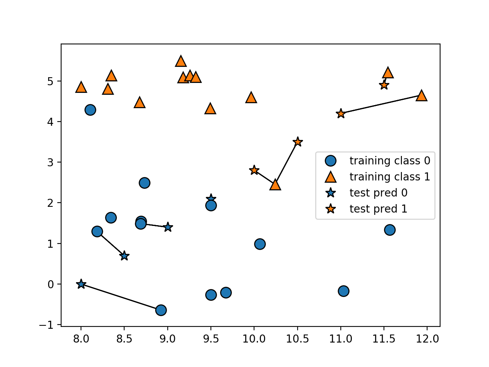
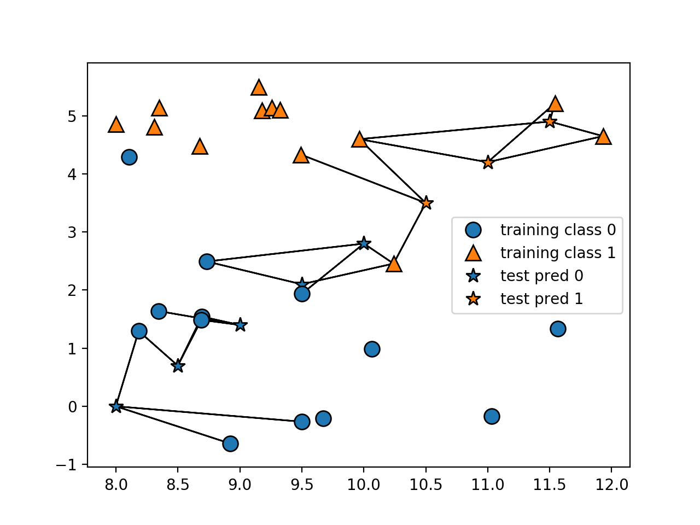
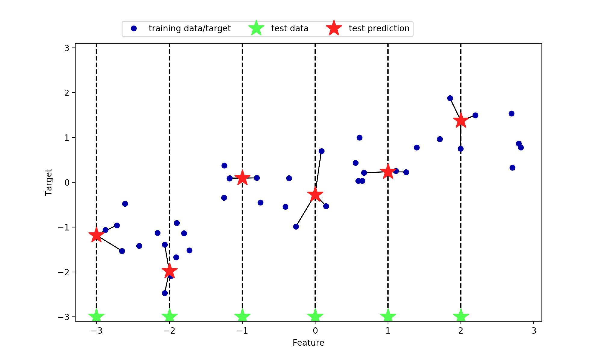

# k-最近傍法

## クラス分類
k-最近傍法のアルゴリズムは、新規データに対する予測をする場合に、新規データに対して一番近いデータを発見し、クラス分類するだけの最も単純な学習アルゴリズムである。

```python
import numpy as np
import matplotlib.pyplot as plt
import mglearn
from mglearn.make_blobs import make_blobs
from mglearn.plot_helpers import discrete_scatter
from mglearn.datasets import make_forge

from sklearn.metrics import euclidean_distances
from sklearn.neighbors import KNeighborsClassifier

def plot_knn_classification(n_neighbors=1):
    X, y = make_forge()
    x_test = np.arange(8, 12, 0.5)
    y_test = (x_test - 8) * 1.4
    X_test = np.c_[x_test, y_test]

    clf = KNeighborsClassifier(n_neighbors=n_neighbors).fit(X, y)
    test_points = discrete_scatter(X_test[:, 0], X_test[:, 1], clf.predict(X_test), markers="*")
    training_points = discrete_scatter(X[:, 0], X[:, 1], y)
    plt.legend(training_points + test_points, ["training class 0", "training class 1","test pred 0", "test pred 1"])

    dist = euclidean_distances(X, X_test)
    closest = np.argsort(dist, axis=0)

    for x, neighbors in zip(X_test, closest.T):
        for neighbor in neighbors[:n_neighbors]:
            plt.arrow(x[0], x[1], X[neighbor, 0] - x[0],
                      X[neighbor, 1] - x[1], head_width=0, fc='k', ec='k')

if __name__ == "__main__":
    plot_knn_classification(n_neighbors=1)
    plt.show()
```
 

``` plot_knn_classification ``` のパラメーターを変更してすると、一番近いところだけではなく、近くからの n個の多数決となる。

``` python
if __name__ == "__main__":
    plot_knn_classification(n_neighbors=3)
    plt.show()
```
 

## 近傍回帰
クラス分類と同じアルゴリズムで回帰予測を行うことが出来る。

``` python
import numpy as np
import matplotlib.pyplot as plt
import mglearn

from sklearn.neighbors import KNeighborsRegressor
from sklearn.metrics import euclidean_distances

from mglearn.datasets import make_wave
from mglearn.plot_helpers import cm3

def plot_knn_regression(n_neighbors=1):
    X, y = make_wave(n_samples=40)
    #X_test = np.array([[-1.5], [0.9], [1.5]])
    X_test = np.reshape(np.arange(-3.0, 3.0, 1.0), (-1, 1))
    dist = euclidean_distances(X, X_test)
    closest = np.argsort(dist, axis=0)

    plt.figure(figsize=(10, 6))

    reg = KNeighborsRegressor(n_neighbors=n_neighbors).fit(X, y)
    y_pred = reg.predict(X_test)

    train, = plt.plot(X, y, 'o', c=cm3(0))
    test, = plt.plot(X_test, -3 * np.ones(len(X_test)), '*', c=cm3(2), markersize=20)
    pred, = plt.plot(X_test, y_pred, '*', c=cm3(1), markersize=20)
    plt.vlines(X_test, -3.1, 3.1, linestyle="--")

    for x, y_, neighbors in zip(X_test, y_pred, closest.T):
        for neighbor in neighbors[:n_neighbors]:
                plt.arrow(x[0], y_, X[neighbor, 0] - x[0], y[neighbor] - y_,
                          head_width=0, fc='k', ec='k')

    plt.legend([train, test, pred],
               ["training data/target", "test data", "test prediction"],
               ncol=3, loc=(.1, 1.025))
    plt.ylim(-3.1, 3.1)
    plt.xlabel("Feature")
    plt.ylabel("Target")

if __name__ == "__main__":
    plot_knn_regression(n_neighbors=3)
    plt.show()

```



