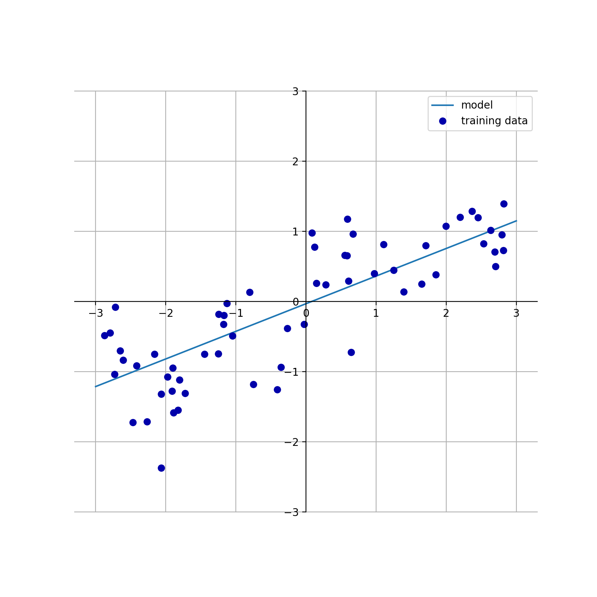
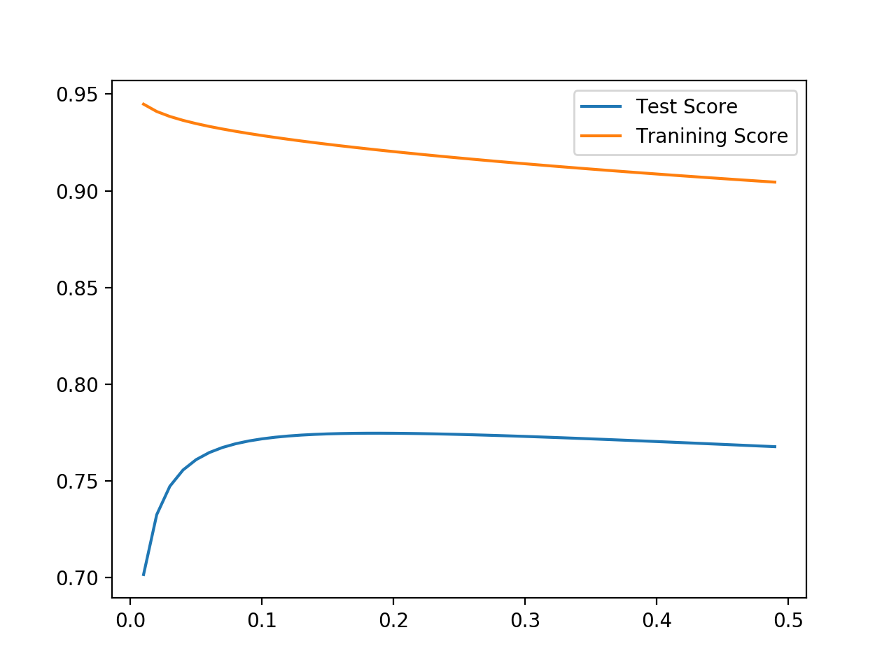
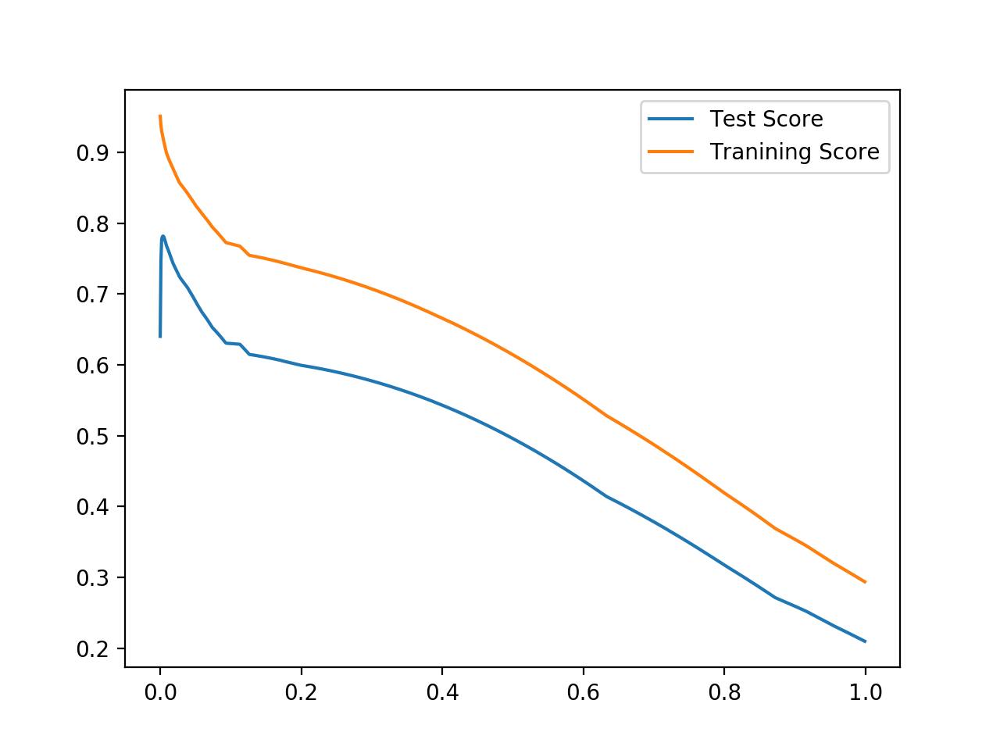

# 線形回帰

## 線形回帰

``` python
import numpy as np
import matplotlib.pyplot as plt
import mglearn

from sklearn.linear_model import LinearRegression
from sklearn.model_selection import train_test_split
from mglearn.datasets import make_wave
from mglearn.plot_helpers import cm2


def plot_linear_regression_wave():
    X, y = make_wave(n_samples=60)
    X_train, X_test, y_train, y_test = train_test_split(X, y, random_state=42)

    line = np.linspace(-3, 3, 100).reshape(-1, 1)

    lr = LinearRegression().fit(X_train, y_train)
    print("w[0]: %f  b: %f" % (lr.coef_[0], lr.intercept_))

    plt.figure(figsize=(8, 8))
    plt.plot(line, lr.predict(line))
    plt.plot(X, y, 'o', c=cm2(0))
    ax = plt.gca()
    ax.spines['left'].set_position('center')
    ax.spines['right'].set_color('none')
    ax.spines['bottom'].set_position('center')
    ax.spines['top'].set_color('none')
    ax.set_ylim(-3, 3)
    ax.legend(["model", "training data"], loc="best")
    ax.grid(True)
    ax.set_aspect('equal')

if __name__ == "__main__":
    plot_linear_regression_wave()
    plt.show()

```

LinearRegressionを fitting させた結果の coef_ が傾き・係数（coefficient)で、intercept_ が切片である。

 


訓練データとテストdataに対するスコアを出す場合以下のコード。

``` python
import numpy as np
import mglearn

from sklearn.linear_model import LinearRegression
from sklearn.model_selection import train_test_split
from mglearn.datasets import make_wave


def linear_regression_wave():
    X, y = make_wave(n_samples=60)
    X_train, X_test, y_train, y_test = train_test_split(X, y, random_state=42)

    line = np.linspace(-3, 3, 100).reshape(-1, 1)

    lr = LinearRegression().fit(X_train, y_train)
    print("w[0]: %f  b: %f" % (lr.coef_[0], lr.intercept_))
    print("Training set score : {:.2f}". format(lr.score(X_train, y_train)))
    print("Test set score ] {:.2f}".format(lr.score(X_test, y_test)))
    
if __name__ == "__main__":
    linear_regression_wave()
```
```
w[0]: 0.393906  b: -0.031804
Training set score : 0.67
Test set score ] 0.66
```

この場合、そもそも訓練データでも67%の適合率で適合不足である。ただし、テストデータでもほぼ同じ値なので、過剰適合ではない。

別の105の特徴量を持つサンプルの場合には、

``` python
import numpy as np
import mglearn

from sklearn.linear_model import LinearRegression
from sklearn.model_selection import train_test_split
from mglearn.datasets import load_extended_boston

def linear_regression_housing():
    X, y = load_extended_boston()
    X_train, X_test, y_train, y_test = train_test_split(X, y, random_state=0)

    line = np.linspace(-3, 3, 100).reshape(-1, 1)

    lr = LinearRegression().fit(X_train, y_train)
    print("w[0]: %f  b: %f" % (lr.coef_[0], lr.intercept_))
    print("Training set score : {:.2f}". format(lr.score(X_train, y_train)))
    print("Test set score ] {:.2f}".format(lr.score(X_test, y_test)))
    
if __name__ == "__main__":
    linear_regression_housing()
```

```
w[0]: -402.752236  b: 31.645174
Training set score : 0.95
Test set score ] 0.61
```
この場合は、訓練データのみが適合率が高く、テストデータでは適合率が悪いので、過剰適合と考えられる。

## リッジ回帰
リッジ回帰も線形モデルの一つであるが、個々の特徴量が出力に与える影響力をなるべく小さくてする方法である。
上記の 105個の特徴量をリッジ回帰で測定した場合、

``` python
import numpy as np
import mglearn

from sklearn.linear_model import Ridge
from sklearn.model_selection import train_test_split
from mglearn.datasets import load_extended_boston

def linear_regression_boston():
    X, y = load_extended_boston()
    X_train, X_test, y_train, y_test = train_test_split(X, y, random_state=0)

    ridge = Ridge().fit(X_train, y_train)
    print("w[0]: %f  b: %f" % (ridge.coef_[0], ridge.intercept_))
    print("Training set score : {:.2f}". format(ridge.score(X_train, y_train)))
    print("Test set score ] {:.2f}".format(ridge.score(X_test, y_test)))
    
if __name__ == "__main__":
    linear_regression_boston()

```
```
Training set score : 0.89
Test set score ] 0.75
```

訓練データに対する適合度は下がるが、過剰適合は低くなっている。

```Ridge()```には、alphaの値があり、デフォルトは 1.0 でこの値を変化させて、最適なモデルでを求める。

``` python
import numpy as np
import matplotlib.pyplot as plt
import mglearn

from sklearn.linear_model import Ridge
from sklearn.model_selection import train_test_split
from mglearn.datasets import load_extended_boston

def ridge_fit(alpha, X_train, X_test, y_train, y_test):
    ridge = Ridge(alpha=alpha).fit(X_train, y_train)
    #print("w[0]: %f  b: %f" % (ridge.coef_[0], ridge.intercept_))
    #print("Training set score : {:.2f}". format(ridge.score(X_train, y_train)))
    #print("Test set score ] {:.2f}".format(ridge.score(X_test, y_test)))
    return ridge.score(X_train, y_train), ridge.score(X_test, y_test)

def linear_regression_boston():
    X, y = load_extended_boston()
    X_train, X_test, y_train, y_test = train_test_split(X, y, random_state=0)
    limit = np.arange(0.01, 0.50, 0.01)

    training_scores = np.zeros(len(limit), dtype=float)
    test_scores = np.zeros(len(limit), dtype=float)

    for i, alpha in enumerate(limit):
      training_scores[i], test_scores[i] = ridge_fit(alpha, X_train, X_test, y_train, y_test)
    
    plt.plot(limit, test_scores, label="Test Score")
    plt.plot(limit, training_scores, label="Tranining Score")
    plt.legend()
    plt.show()

if __name__ == "__main__":
    linear_regression_boston()

```




## Lasso

Lasso は、Ridge と同様に個々の特徴量が出力に与える影響力を小さくてする方法である。
Ridge との差分は、小さくするにあたり、いくつかの特徴量の影響を完全にゼロにする。

下記は、alpha の値を変えて３回試行するサンプルである。

``` python
import numpy as np
import mglearn

from sklearn.linear_model import Lasso
from sklearn.model_selection import train_test_split
from mglearn.datasets import load_extended_boston

def linear_regression_boston(alpha):
    X, y = load_extended_boston()
    X_train, X_test, y_train, y_test = train_test_split(X, y, random_state=0)

    lasso = Lasso(alpha=alpha, max_iter=100000).fit(X_train, y_train)
    print("-------------------")
    print("[alpha : {}]Training set score: {:.2f}".format(alpha, lasso.score(X_train, y_train)))
    print("[alpha : {}]Test set score: {:.2f}".format(alpha, lasso.score(X_test, y_test)))
    print("[alpha : {}]Number of features used: {}".format(alpha, np.sum(lasso.coef_ != 0)))
    
if __name__ == "__main__":
    alpha = [1.0, 0.01, 0.0001]

    for val in alpha:
      linear_regression_boston(val)
      
```

```
-------------------
[alpha : 1.0]Training set score: 0.29
[alpha : 1.0]Test set score: 0.21
[alpha : 1.0]Number of features used: 4
-------------------
[alpha : 0.01]Training set score: 0.90
[alpha : 0.01]Test set score: 0.77
[alpha : 0.01]Number of features used: 33
-------------------
[alpha : 0.0001]Training set score: 0.95
[alpha : 0.0001]Test set score: 0.64
[alpha : 0.0001]Number of features used: 94
```

下記は、0.0001 - 1.0 の間での最適な alpha を求めるサンプルである。

``` python
import numpy as np
import matplotlib.pyplot as plt
import mglearn

from sklearn.linear_model import Lasso
from sklearn.model_selection import train_test_split
from mglearn.datasets import load_extended_boston

def lasso_fit(alpha, X_train, X_test, y_train, y_test):
    lasso = Lasso(alpha=alpha, max_iter=100000).fit(X_train, y_train)
    return lasso.score(X_train, y_train), lasso.score(X_test, y_test)

def linear_regression_boston():
    X, y = load_extended_boston()
    X_train, X_test, y_train, y_test = train_test_split(X, y, random_state=0)
    limit = np.arange(0.0001, 1.0001, 0.001)

    training_scores = np.zeros(len(limit), dtype=float)
    test_scores = np.zeros(len(limit), dtype=float)

    best_score = 0.0
    best_alpha = 0.0
    for i, alpha in enumerate(limit):
      training_scores[i], test_scores[i] = lasso_fit(alpha, X_train, X_test, y_train, y_test)
      if best_score < test_scores[i]:
        best_score = test_scores[i]
        best_alpha = alpha

    print("Best Alpha : {}, Best Score : {}".format(best_alpha, best_score))

    plt.plot(limit, test_scores, label="Test Score")
    plt.plot(limit, training_scores, label="Tranining Score")
    plt.legend()
    plt.show()
    
if __name__ == "__main__":
    linear_regression_boston()
```
```
Best Alpha : 0.0041, Best Score : 0.7819745482315341
```




