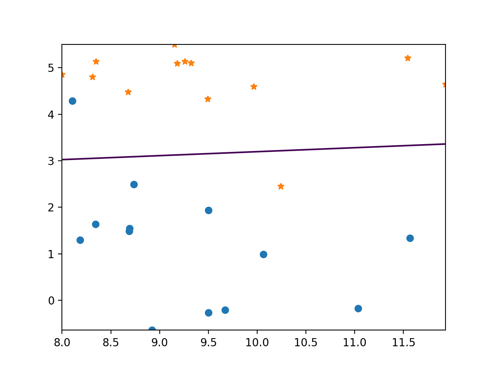
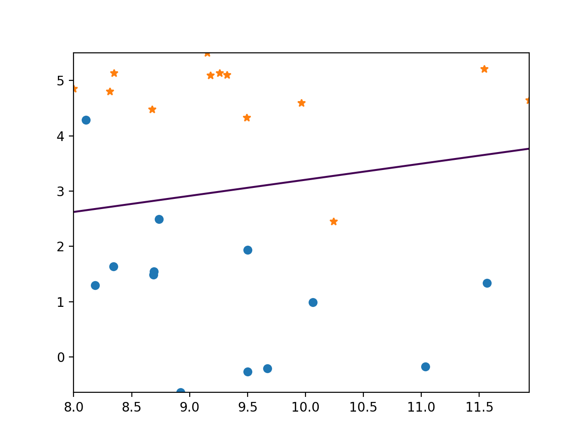
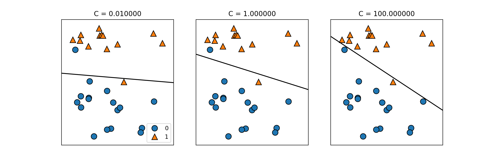

# 線形分類

## サポートベクタークラス分類

### SVC(Support Vector Classifier)

forge データを分類し、境界点(0)に線を引く。

``` python
from sklearn.svm import LinearSVC
import mglearn
import numpy as np
import matplotlib.pyplot as plt

X, y = mglearn.datasets.make_forge()

clf = LinearSVC().fit(X, y)

x_min, x_max = X[:, 0].min(), X[:, 0].max() 
y_min, y_max = X[:, 1].min(), X[:, 1].max() 

xx = np.linspace(x_min, x_max, 1000)
yy = np.linspace(y_min, y_max, 1000)

X1, X2 = np.meshgrid(xx, yy)
X_grid = np.c_[X1.ravel(), X2.ravel()]

decision_values = clf.decision_function(X_grid)

plt.contour(X1, X2, decision_values.reshape(X1.shape), levels=[0])
plt.plot(X[y==0][:,0], X[y==0][:,1], "o")
plt.plot(X[y==1][:,0], X[y==1][:,1], "*")

plt.show()
```



### ロジスティック回帰（Logistic Regression)

モデルを LogisticRegression にすると、ロジスティック回帰による分類になる。

``` python
from sklearn.linear_model import LogisticRegression

clf = LogisticRegression().fit(X, y)

```



### 正則化強度（C)

モデルに正則化強度（C)を指定することで、正則化の調整が出来る。

``` python
LogisticRegression(C=0.001)
LinearSVC(C=0.001)
```




Cancer データを使った、C の値毎のスコア比較。

``` python
from sklearn.datasets import load_breast_cancer
from sklearn.model_selection import train_test_split
from sklearn.linear_model import LogisticRegression
from sklearn.svm import LinearSVC

cancer = load_breast_cancer()

X_train, X_test, y_train, y_test = train_test_split(cancer.data, cancer.target, stratify=cancer.target, random_state=42)

Cs = [1.0, 100, 0.01]

print("Logistic Regression")
for c in Cs:
  logreg = LogisticRegression(C=c).fit(X_train, y_train)
  print(" C={}".format(c))
  print("  Training set score: {:.3f}".format(logreg.score(X_train, y_train)))
  print("  Test set score: {:.3f}".format(logreg.score(X_test, y_test)))

print("Liner SVC")
for c in Cs:
  logreg = LinearSVC(C=c).fit(X_train, y_train)
  print(" C={}".format(c))
  print("  Training set score: {:.3f}".format(logreg.score(X_train, y_train)))
  print("  Test set score: {:.3f}".format(logreg.score(X_test, y_test)))
```

```
Logistic Regression
 C=1.0
  Training set score: 0.953
  Test set score: 0.958
 C=100
  Training set score: 0.972
  Test set score: 0.965
 C=0.01
  Training set score: 0.934
  Test set score: 0.930
Liner SVC
 C=1.0
  Training set score: 0.934
  Test set score: 0.937
 C=100
  Training set score: 0.932
  Test set score: 0.944
 C=0.01
  Training set score: 0.925
  Test set score: 0.930

```

