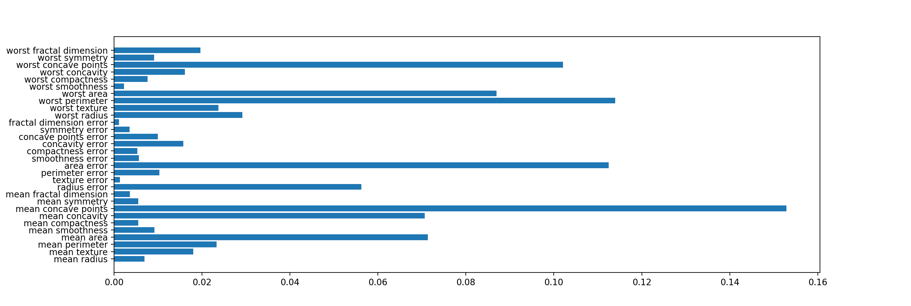

# ランダムフォレスト

## ランダムフォレスト
ランダムフォレストは、複数の機械学習モデルを組み合わせる事でより強力なモデルを作成するアンサンブル法という手法のひとつ。
ランダムフォレストでは、決定木を少しずつ変更したして複数の結果をだし、その平均をとることで過剰適合を避ける事ができる。

### ランダムフォレストの例

``` python
from sklearn.ensemble import RandomForestClassifier
from sklearn.datasets import load_breast_cancer
from sklearn.model_selection import train_test_split

cancer = load_breast_cancer()

X_train, X_test, y_train, y_test = train_test_split(cancer.data, cancer.target, random_state=0)

forest = RandomForestClassifier(n_estimators=100, random_state=0)
forest.fit(X_train, y_train)

print("Accuracy on training set: {:.3f}".format(forest.score(X_train, y_train)))
print("Accuracy on test set : {:.3f}".format(forest.score(X_test, y_test)))
```

```
Accuracy on training set: 1.000
Accuracy on test set : 0.972
```

決定木では、最高でも95%だったが、ランダムフォレストでは、97%を出している。

### 決定の重要度
決定木の時と同様に、各要素の重要度を調べる。

``` python
import matplotlib.pyplot as plt

plt.barh(range(cancer.data.shape[1]), forest.feature_importances_)
plt.yticks(range(cancer.data.shape[1]), cancer.feature_names)


plt.show()
```



決定木と比較すると、より幅広くデータを見ている事がわかる。


