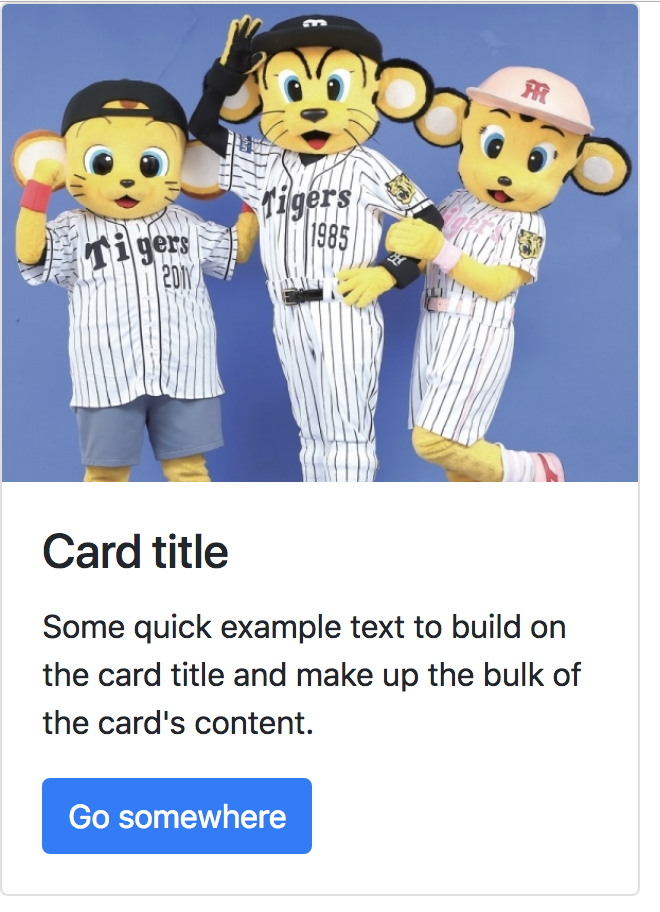

# Bootstrap 4 on Angular 6

## Angular 環境

```
$ ng version

     _                      _                 ____ _     ___
    / \   _ __   __ _ _   _| | __ _ _ __     / ___| |   |_ _|
   / △ \ | '_ \ / _` | | | | |/ _` | '__|   | |   | |    | |
  / ___ \| | | | (_| | |_| | | (_| | |      | |___| |___ | |
 /_/   \_\_| |_|\__, |\__,_|_|\__,_|_|       \____|_____|___|
                |___/
    

Angular CLI: 6.0.3
Node: 10.1.0
OS: darwin x64
Angular: 
... 

Package                      Version
------------------------------------------------------
@angular-devkit/architect    0.6.3
@angular-devkit/core         0.6.3
@angular-devkit/schematics   0.6.3
@schematics/angular          0.6.3
@schematics/update           0.6.3
rxjs                         6.1.0
typescript                   2.7.2

```

## サンプル作成
### app 生成
```
$ ng new angular-bootstrap
```
### bootsrap4 の導入
```
$ cd angular-bootstrap/
$ npm install --save bootstrap@4.0.0
$ npm install --save jquery popper.js
```

### angular.json の編集
参考リンクでは、.angular-cli.json となっているが、angular 6 では、angular.json が設定ファイルになっている。
正確には、angular-cli の version 6 への変更に伴い、この変更が発生しているらしい。

``` json
{
  "$schema": "./node_modules/@angular/cli/lib/config/schema.json",
  "version": 1,
  "newProjectRoot": "projects",
  "projects": {
    "angular-bootstrap": {
      "root": "",
      "sourceRoot": "src",
      
... 略
            "styles": [
              "src/styles.css",
+             "node_modules/bootstrap/dist/css/bootstrap.min.css"
            ],
            "scripts": [
+              "node_modules/jquery/dist/jquery.slim.min.js",
+              "node_modules/popper.js/dist/umd/popper.min.js",
+              "node_modules/bootstrap/dist/js/bootstrap.min.js"
            ]
... 略
         
```
参考リンクでは、 node_modules の位置が ../node_modules となっているが、この環境では直下にある。

### サンプルモジュールの作成

```
$ ng g component card-ui

```
#### card-ui.component.html
``` html
<div class="card" style="width: 20rem;">
  
  <div class="card-body">
    <h4 class="card-title">Card title</h4>
    <p class="card-text">Some quick example text to build on the card title and make up the bulk of the card's content.</p>
    <a href="#" class="btn btn-primary">Go somewhere</a>
  </div>
</div>
```
#### app.component.html
``` html
<!--The content below is only a placeholder and can be replaced.-->
<app-card-ui></app-card-ui>
```

### サンプルモジュールビルド
```
$ ng serve
** Angular Live Development Server is listening on localhost:4200, open your browser on http://localhost:4200/ **
                                                                                          
Date: 2018-07-21T04:11:19.020Z
Hash: bc97babb651f342ec2f7
Time: 7721ms
chunk {main} main.js, main.js.map (main) 13.1 kB [initial] [rendered]
chunk {polyfills} polyfills.js, polyfills.js.map (polyfills) 227 kB [initial] [rendered]
chunk {runtime} runtime.js, runtime.js.map (runtime) 5.22 kB [entry] [rendered]
chunk {scripts} scripts.js, scripts.js.map (scripts) 139 kB  [rendered]
chunk {styles} styles.js, styles.js.map (styles) 153 kB [initial] [rendered]
chunk {vendor} vendor.js, vendor.js.map (vendor) 3.06 MB [initial] [rendered]
ℹ ｢wdm｣: Compiled successfully.

```
### 表示




## 参考
[Angular5 で Bootstrap4 ( beta ) を使ってみよう](https://dev.classmethod.jp/server-side/serverless/angular5-bootstrap4/)
