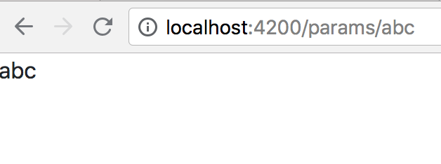
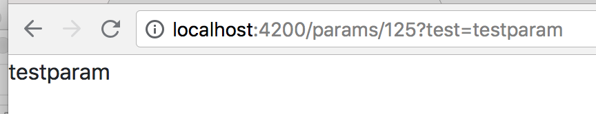

# Rooting

## 前提条件
すでに、Application は構築され、Application のルートディレクトリにいる前提とする。

## Dashboard と ルートの追加・リダイレクト設定
### Dashboard の作成
一つの実装として、デフォルトの Redirect 先として、dashboard というコンポーネントを追加する。  
これはあくまで一つの例であり、"Dashboard" である必要は必ずしもない。

```
$ ng generate component dashboard
```


### Rooting Module の追加

```
ng generate module app-routing --flat --module=app
```

src/app の下に、app-routing.module.ts が出来上がるので、下記のように編集する。

``` typescript:app-routing.module.ts
import { NgModule } from '@angular/core';
import { RouterModule, Routes } from '@angular/router';
import { DashboardComponent }   from './dashboard/dashboard.component';

const routes: Routes = [
  { path: '', redirectTo: '/dashboard', pathMatch: 'full' },
  { path: 'dashboard', component: DashboardComponent }
];

@NgModule({
  imports: [ RouterModule.forRoot(routes) ],
  exports: [ RouterModule ]
})
export class AppRoutingModule { }

```

RouterModule.forRoot(routes) が、ルートを登録する処理を行っている。  


app.component.html を下記のように編集。

``` html:app.component.html
<router-outlet></router-outlet>
```

### 動作
http://localhost:4200/ は http://localhost:4200/dashboard にリダイレクトされ、dashboard component が表示されるようになる。


## パラメータ付きルート
### パラメーターを受け取るコンポーネントを作成

```
$ ng generate component withparam
```

### ルートを追加
app-routing.module.ts の routes にルートを追加。  

``` typescript:app-routing.module.ts
import { WithparamComponent } from './withparam/withparam.component';

const routes: Routes = [
  	{ path: '', redirectTo: '/dashboard', pathMatch: 'full' },
  	{ path: 'dashboard', component: DashboardComponent },
+ 	{ path: 'params/:param', component: WithparamComponent }
];

```
### パラメーターを component のなかで参照する
withparam.component.ts

``` typescript:withparam.component.ts

import { Component, OnInit } from '@angular/core';
import { ActivatedRoute } from '@angular/router'; **

@Component({
  selector: 'app-withparam',
  templateUrl: './withparam.component.html',
  styleUrls: ['./withparam.component.css']
})
export class WithparamComponent implements OnInit {
  param: string;

  constructor(private route: ActivatedRoute) { }

  ngOnInit() {
    this.param= this.route.snapshot.paramMap.get('param');
  }

}

```

パラメーターの参照については、[ActivatesRouteSnapshot](https://angular.io/api/router/ActivatedRouteSnapshot) を参照。


withparam.component.html

``` html: withparam.component.html
<p>
  {{param}}
</p>

```

### 動作結果


### query string を取る場合
``` typescript:withparam.component.ts
  ngOnInit() {
    this.param= this.route.snapshot.queryParams.test;
  }
```




