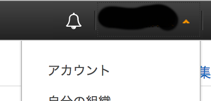
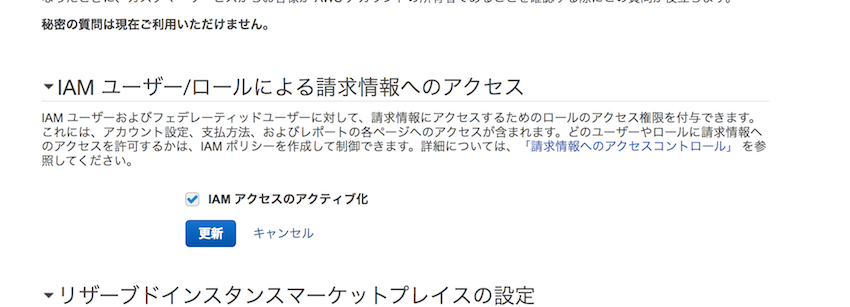
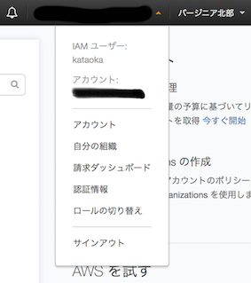

#IAM

## IAM ユーザーへの 請求管理権限
Default では、IAMユーザーは、Billing Information にはアクセスできなくなっている。

[請求の情報およびツールへのアクセス許可](http://docs.aws.amazon.com/ja_jp/awsaccountbilling/latest/aboutv2/grantaccess.html)

の「Billing and Cost Management コンソールへのアクセスのアクティベート」に書かれているが、「ナビゲーションバーでアカウントを選択」のところがわかりにくい。

上の帯の部分が「ナビゲーションバー」で、そこのアカウント名をクリックするとプルダウンで「アカウント」があるのでそれを選択ということらしい。

そうすると、そのページの中段ぐらいに

が出てくるので、これをアクティブにする。

これにより、admin 権限を持つ IAM ユーザーは、請求ダッシュボードを見ることができる。

