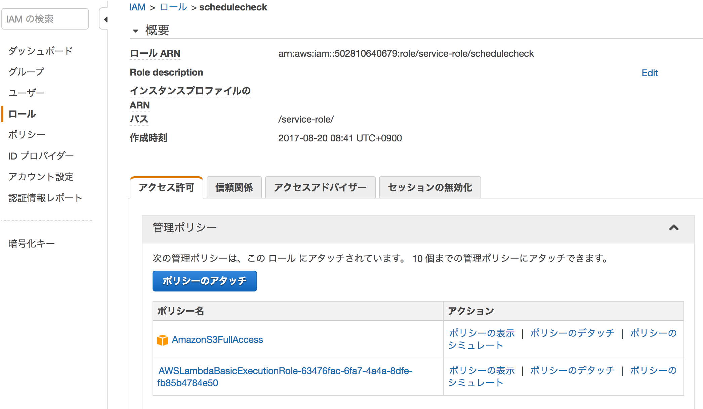
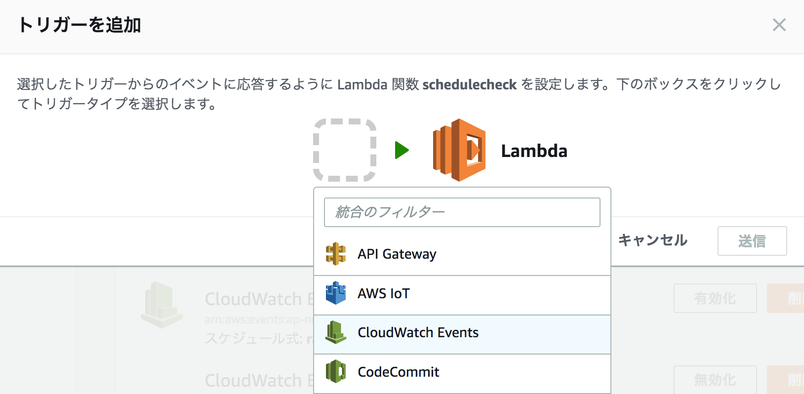
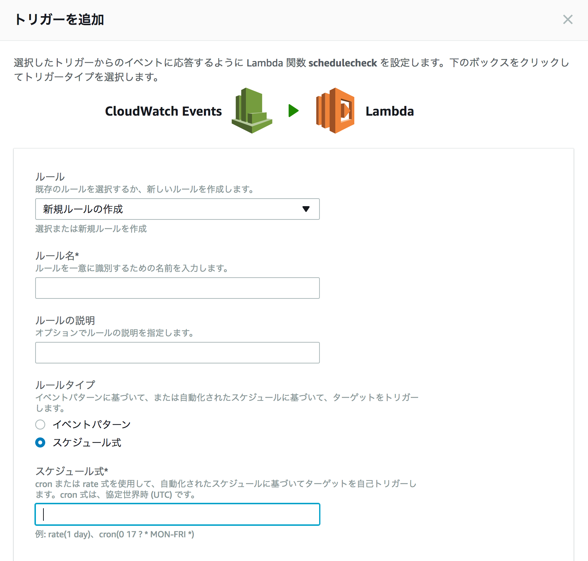
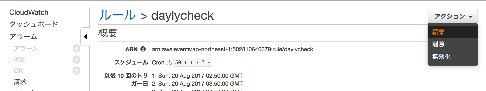
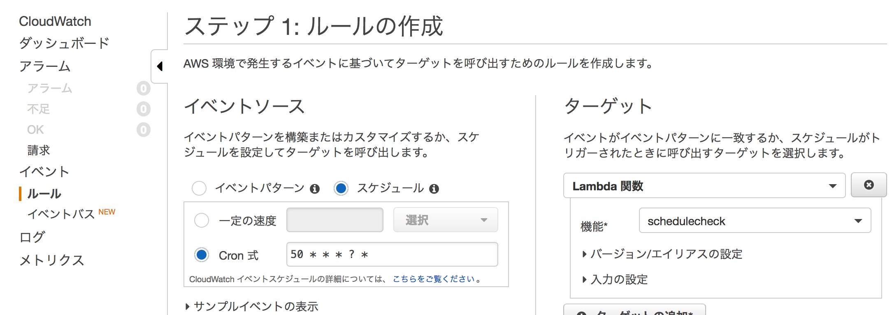

# Lambda

## deploy package の作成
Lambda サーバー上では、pip による外部パッケージのインストールはできないので、外部パッケージを含んだ zip ファイルを作成する必要がある。これを deploy packege と呼ぶ。

### 外部パッケージのダウンロード
pip でダウンロード先を deploy packege 以下に指定する。

``` 
$ mkdir deploy
$ cd deploy
$ $ pip install $(External Package) -t .
```
[参考]  
[pip](https://pip.pypa.io/en/latest/)  
[Lambdaでpipしたいと思ったときにすべきこと](http://qiita.com/Hironsan/items/0eb5578f3321c72637b4)


### アーカイブ
Win Archive とかで zip を作成すると、アップロード後に編集できなくなっていた。
下記のように zip コマンドで作成

```
zip -r9 ../schedulecheck.zip *
```
[デプロイパッケージを作成する](http://docs.aws.amazon.com/ja_jp/lambda/latest/dg/with-s3-example-deployment-pkg.html#with-s3-example-deployment-pkg-python)

うまく deploy できれば、以後、ダッシュボード上で、編集可能になる。

### ロール
[設定] => ロール で設定する。
ここは「既存のロールを選択」で構わないが、AIM で、適切なロールの設定が必要になる。

例えば、この Lambda 関数が S3 に読み書きする場合、この関数のロール（RoleA）に対して、AIM のダッシュボードから操作して、必要なポリシー（この場合、AmazonS3FullAccess)をアタッチしなければいけない。




## イベント
### 定期実行(rate / cron)
定期実行は、CloudWatch Events から設定する。  



トリガー追加時に、スケジュール式を設定することで、意図したタイミングで動作することができる。



一度、設定した後は、CloudWatch サービスの方で設定変更することになる。



___

CloudWatch Event の cron 式を変更する。  
ここでの設定方式については、
[Rate または Cron を使用したスケジュール式](http://docs.aws.amazon.com/ja_jp/lambda/latest/dg/tutorial-scheduled-events-schedule-expressions.html) を参照。  

設定する時間は UTC 時間になるので、日本時間（JST）から -9時間した値を設定する。




## 参考
[プログラム初心者がAWS Lambda(Python)でハマった7個のこと](http://blog.serverworks.co.jp/tech/2016/08/31/lambda-point/)


