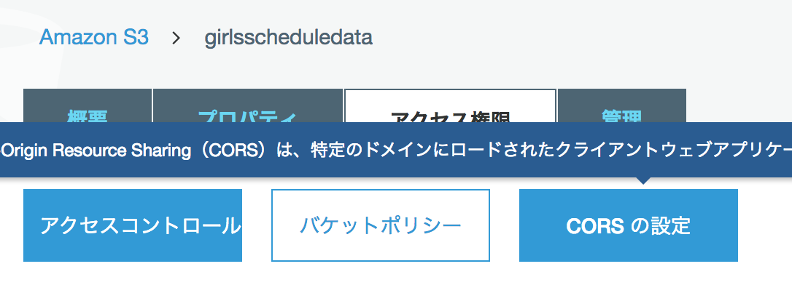
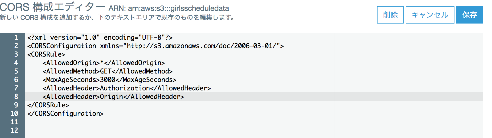
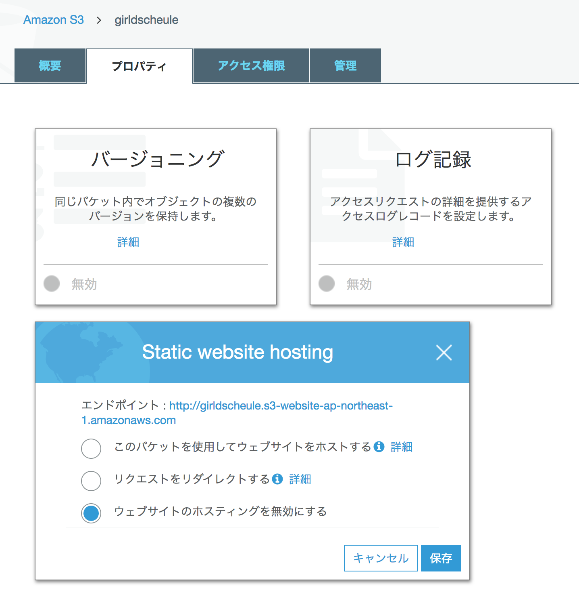
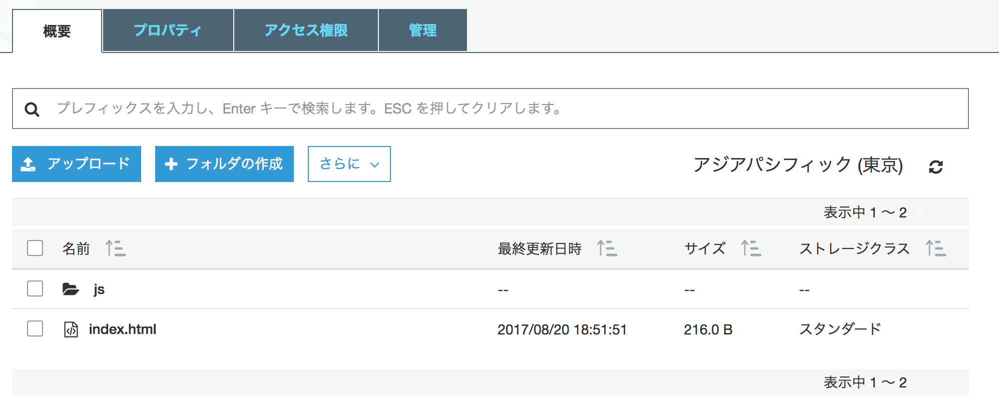

# S3

## Cross Domain 対応
### Bucket の 権限設定
ファイルではなく、bucket に権限を設定。

AllowedHeader>Origin</AllowedHeader>

を追加。

[参考]  
[amazon S3画像へのクロスドメイン接続を許可する](http://qiita.com/takahi5/items/ffa5b87eac7dd81a7038)  
[S3ってなんじゃ？(CORS対応) ](http://memocra.blogspot.jp/2012/09/s3cors.html)

## 静的ウェブサイトのホスティング
### Bucket の設定
Bucketの設定で、静的 WebHosting を有効にする。

ただし、これを有効にしなくても、Webサイトとして見ることができる。

### ファイル（HTML/JavaScript/Style Sheet等）をアップロード

適宜、フォルダを作成する。

全てのファイルに Public 読み取り権限が必要で、アップロード時に設定する。すでにアップロード済みの場合、都度、設定を行う。

